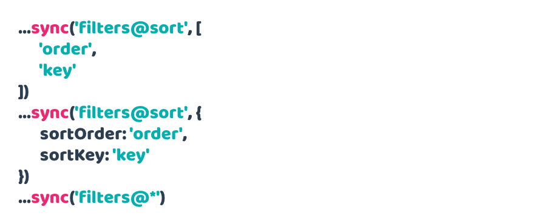

## Overview

Pathify makes working with Vuex **easy**, with a **declarative**, **state-based**, **path syntax**:

Paths can reference any **module**, **property** or (nested) **sub-property**:

**Get** or **set** data without **syntax juggling** or worrying about **implementation**:

Set up **one or two-way** data binding on **any** store value without **bloat** or **fuss**:

Wire **multiple** properties (or sub-properties) using **array**, **object** and **wildcard** formats:

Set up your store – **no matter how complex** – in a single line:

And... that's it.

Pathify does this **all within the bounds of Vuex**; no hacks, just [configuration](/docs/guide/config.md), [path syntax](/docs/api/paths.md), and [helpers](/docs/api/component.md).

## Vuex comparison

The start of a Vuex project usually requires manual and painstaking store setup:

 
Getting and setting values requires juggling accessors, syntax and naming:

Component wiring can require up to 4 different helpers, name juggling, plus additional template binding:

Writing computed properties takes this much code **per property** for 2-way wiring:

Essentially, vanilla Vuex takes a lot of manual JavaScript coding to both set up and maintain.

Check out the [code comparison](https://codesandbox.io/s/github/davestewart/vuex-pathify/tree/master/demo?initialpath=code) demo which illustrates a reduction in Vuex code when using Pathify, of between **2 and 14 times** (or more) depending on store size and setup.

## Summary

In practical terms, Pathify results in:

- less cognitive overhead
- zero store boilerplate
- one-liner wiring
- cleaner code
- lighter files

### Next steps

- Read the [documentation](https://davestewart.github.io/vuex-pathify/) to find out more
- Check out the [demo](https://codesandbox.io/s/github/davestewart/vuex-pathify/tree/master/demo) to see the code in action
- Install the [package](https://www.npmjs.com/package/vuex-pathify) from NPM

