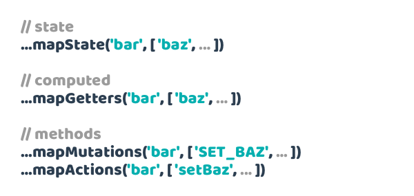

<h2>Overview</h2>

Pathify makes working with Vuex **easy**, with a **declarative, state-based, path syntax**:

Pathify's core helpers provide one-liner **read, write** or **sync** to any store **property** or **sub-property**:

Pathify's store helpers eliminate the time, code and complexity of store setup:

The end result is Vuex projects with significantly less code, complication and cognitive overhead.

## Pathify API

Let's look a little closer at the above example.

The store has **module**, **property** and **sub-property** nodes:

Pathify's one-liner [store helpers] generate mutations **automatically**:

Pathify's [store accessors] handle global **I/O** whilst [component helpers] handle **wiring**:

Pathify's [path syntax] provides sub-property access via the `@` symbol, with wildcard `*` syntax wiring entire groups of properties or sub-properties automatically.

## Comparing to Vuex

The start of a Vuex project usually requires manual and painstaking store setup:

 
Getting and setting values requires juggling accessors, syntax and naming:

Component wiring can require up to 4 different helpers, name juggling, plus additional template binding:

An entire section of Pathify's demo site has been devoted to comparing what could be considered both [typical](https://codesandbox.io/s/github/davestewart/vuex-pathify/tree/master/demo?initialpath=code/typical) and [large](https://codesandbox.io/s/github/davestewart/vuex-pathify/tree/master/demo?initialpath=code/large) components across a variety of Pathify and Vuex setups, and finds Pathify:
 
 - can use anything between 2 and 14 times less code than vanilla Vuex
 - can be up to 2.5 times less complex, using a core of only 6 or 7 different naming, syntax or coding entities, compared to Vuex's maximum of 15 / 18

## Next steps

So if you like what you see, here's where to go next:

- Try the [demo](https://codesandbox.io/s/github/davestewart/vuex-pathify/tree/master/demo)
- Check out the [documentation](https://davestewart.github.io/vuex-pathify/)
- Install the [package](https://www.npmjs.com/package/vuex-pathify)

[path syntax]: https://davestewart.github.io/vuex-pathify/#/api/paths
[component helpers]: https://davestewart.github.io/vuex-pathify/#/api/component
[store helpers]: https://davestewart.github.io/vuex-pathify/#/api/store
[store accessors]: https://davestewart.github.io/vuex-pathify/#/api/accessors

